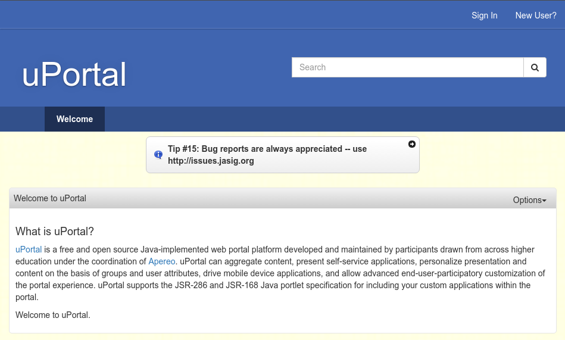

# Skinning uPortal

Defining your own skin is one of the most basic changes that makes your uPortal installation your own.

## Table of Contents

1.  [Creating a skin](#creating-a-skin)
2.  [Skin Configuration](#skin-configuration)
3.  [Special Notes](#special-notes)
    1.  [Dynamic Respondr Skin](#dynamic-respondr-skin)
    2.  [Page Effects](#page-effects)

## Creating a skin

1.  Run `./gradlew skinGenerate -DskinName={skinName}` to create the skin base files.
2.  Navigate to the *uportal-war/src/main/webapp/media/skins/respondr* folder
3.  Edit *skinList.xml* to point the `<skin-name>` and `<skin-key>` to the new skin name. e.g.

    ``` xml
    <skin>
        <skin-key>{skinName}</skin-key>
        <skin-name>{skinName}</skin-name>
        <skin-description>
            Basic skin for the Respondr theme based on Twitter Bootstrap and Responsive Design
        </skin-description>
    </skin>
    ```

4.  Navigate to the *data/base/portlet-definition* folder
5.  Edit *dynamic-respondr-skin.portlet-definition.xml* and add a `<portal-preference>` with a `<name>` of `PREFdynamicSkinName` and a `<value>` with the skin name. e.g.

    ``` xml
    <portlet-preference>
        <name>PREFdynamicSkinName</name>
        <value>{skinName}</value>
    </portlet-preference>
    ```

6.  Navigate to the *data/base/stylesheet-descriptor* folder
7.  Edit *Respondr.stylesheet-descriptor.xml* and change the `<default-value>` to the skin name. e.g.

    ``` xml
    <stylesheet-parameter>
        <name>skin</name>
        <default-value>{skinName}</default-value>
        <scope>PERSISTENT</scope>
        <description>Skin name</description>
    </stylesheet-parameter>
    ```

8.  Stop Tomcat. (Run `./gradlew tomcatStop` if using embedded Tomcat in uPortal-start.)
9.  Run `./gradlew :overlays:uPortal:dataInit` to apply the changes to the database.
10. Run `./gradlew :overlays:uPortal:tomcatDeploy` to build uPortal with the new skin and deploy it to Tomcat.
11. Start Tomcat. (Run `./gradlew tomcatStart` if using embedded Tomcat in uPortal-start.)
12. :warning: **Don’t forget to add the new skin to Git!**

## Skin Configuration

uPortal uses [Less variables](http://lesscss.org/features/#variables-feature) to handle global skin changes.
Changes can be made to override the [Bootstrap variables](/uportal-war/src/main/webapp/media/skins/respondr/common/bootstrap/variables.less) or the [uPortal variables](/uportal-war/src/main/webapp/media/skins/respondr/defaultSkin/less/variables.less), changes should be made to the skin's `variable.less` file.

## Special Notes

### Dynamic Respondr Skin

The color variables 1-6 are the values that the dynamic respondr skin portlet customizes.

``` less
@color1
@color2
@color3
@color4
@color5
@color6
```


### Page Effects

Portal background color and image can have special effects applied.
Setting `@portal-page-body-background-image-filter` allows for any combination [css filters](https://developer.mozilla.org/en-US/docs/Web/CSS/filter) to be applied.



