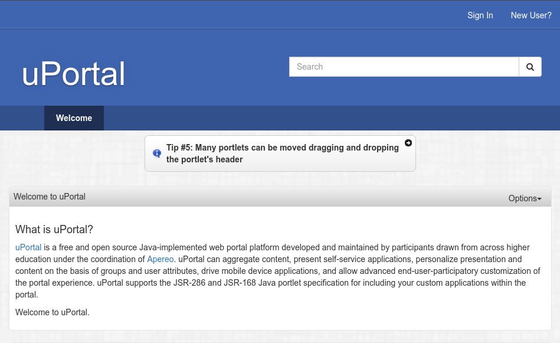

# Skin uPortal

## Table des matières

1.  [Créer une Skin](#créer-une-skin)
2.  [Configuration du Skin](#configuration-du-skin)
3.  [Notes additionnelles](#notes-additionnelles)
    1.  [Dynamic Respondr Skin](#dynamic-respondr-skin)
    2.  [Effets de Page](#effets-de-page)

## Créer une Skin

1.  Commencer par le dossier racine du code source uPortal
2.  Accéder au dossier *uportal-war/src/main/webapp/media/skins*
3.  Copier le dossier *defaultSkin/* et attribuez-lui un nom spécifique à votre institution (par exemple *wolverine/*)
4.  Copier le fichier *defaultSkin.less* et attribuez-lui le même nom (par exemple, *wolverine.less*)
5.  Modifier les imports dans le fichier de Skin pour pointer vers le dossier de skin. par exemple. *wolverine.less*

    ``` less
    /** DO NOT REMOVE OR ALTER THESE INCLUDES **/
    @import "defaultSkin/less/variables.less";
    @import "common/common.less";
    /*******************************************/

    @import "wolverine/less/variables.less";
    @import "wolverine/less/skin.less";
    ```

6.  Accéder au dossier *uportal-war/src/main/webapp/media/skins/respondr*
7.  Éditer *skinList.xml* pour pointer les noms `<skin-name>` et `<skin-key>` vers le nouveau nom de skin. Par exemple.

    ``` xml
    <skin>
        <skin-key>wolverine</skin-key>
        <skin-name>wolverine</skin-name>
        <skin-description>
            Basic skin for the Respondr theme based on Twitter Bootstrap and Responsive Design
        </skin-description>
    </skin>
    ```

8.  Accéder au dossier *uportal-war/src/main/data/default_entities/portlet-definition*
9.  Éditer *dynamic-respondr-skin.portlet-definition.xml* et ajouter une `<portal-preference>` avec un `<name>` de `PREFdynamicSkinName` et une `<value>` avec le nom de la Skin. Par exemple.

    ``` xml
    <portlet-preference>
        <name>PREFdynamicSkinName</name>
        <value>wolverine</value>
    </portlet-preference>
    ```

10. Accéder au dossier *uportal-war/src/main/data/required_entities/stylesheet-descriptor*
11. Éditer *Respondr.stylesheet-descriptor.xml* et changer la `<default-value>` pour le nom de la Skin. Par exemple. 

    ``` xml
    <stylesheet-parameter>
        <name>skin</name>
        <default-value>wolverine</default-value>
        <scope>PERSISTENT</scope>
        <description>Skin name</description>
    </stylesheet-parameter>
    ```

12. Lancer `ant initdb` pour appliquer ces changements en base.
13. Lancer `ant clean deploy-war` pour lancer un Build du portail avec la nouvelle Skin.
14. **Ne pas oublier d'ajouter la Skin à Git!**

## Configuration du Skin

uPortal utilise des [variables Less](http://lesscss.org/features/#variables-feature) pour gérer les changements globaux de Skin.
Des Changements peuvent être fait pour surcharger les [variables Bootstrap](/uportal-war/src/main/webapp/media/skins/respondr/common/bootstrap/variables.less) ou les [variables uPortal](/uportal-war/src/main/webapp/media/skins/respondr/defaultSkin/less/variables.less), les changements devraient surtout être fait au niveau du fichier `variable.less`.

## Notes additionnelles

### Dynamic Respondr Skin

Les variables de `@color` 1-6 sont des valeurs personnalisables via la portlet dynamic respondr skin.

```less
@color1
@color2
@color3
@color4
@color5
@color6
```


### Effets de Page

La couleur de fond et l'image de fond du portail peuvent recevoir des effets spéciaux.
Modifier `@portal-page-body-background-image-filter` permet toutes les combinaisons possible de [filtres css](https://developer.mozilla.org/en-US/docs/Web/CSS/filter) d'être appliqué.




